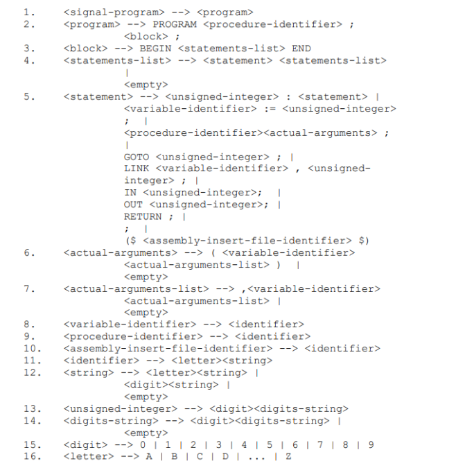
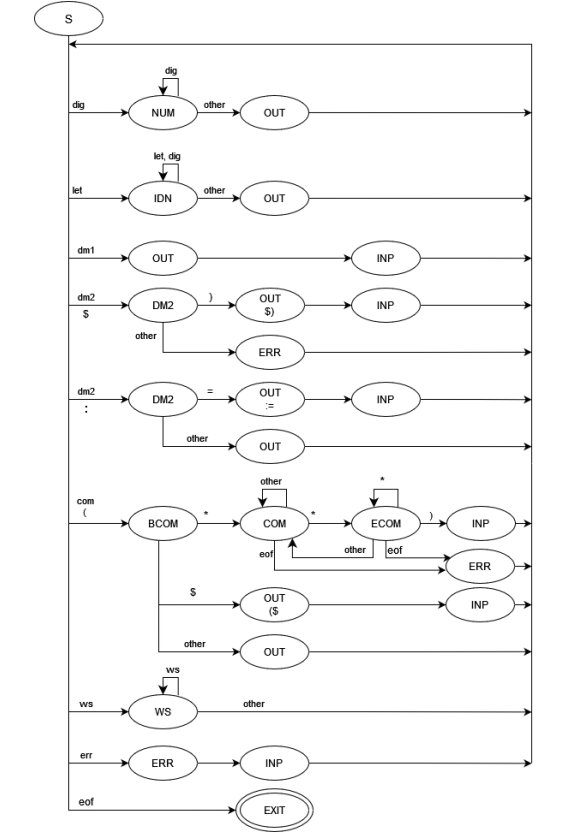

# Interpreter
## Description:
Implemented a lexical analyzer and parser for a custom programming language SIGNAL.

Lexer:
* Classifies keywords, delimiters, constants and identifiers. Stores positions (row, column) and assigns unique IDs.
* Build tables with the stored information.
* Ignores whitespaces, new lines, tabulations and comments.
* Detects and handles errors.

Parser:
* Reads and processes tables from Lexer.
* Generates an abstract syntax tree.
* Detects and handles errors.

## SIGNAL grammar:

## Lexer state diagram:

